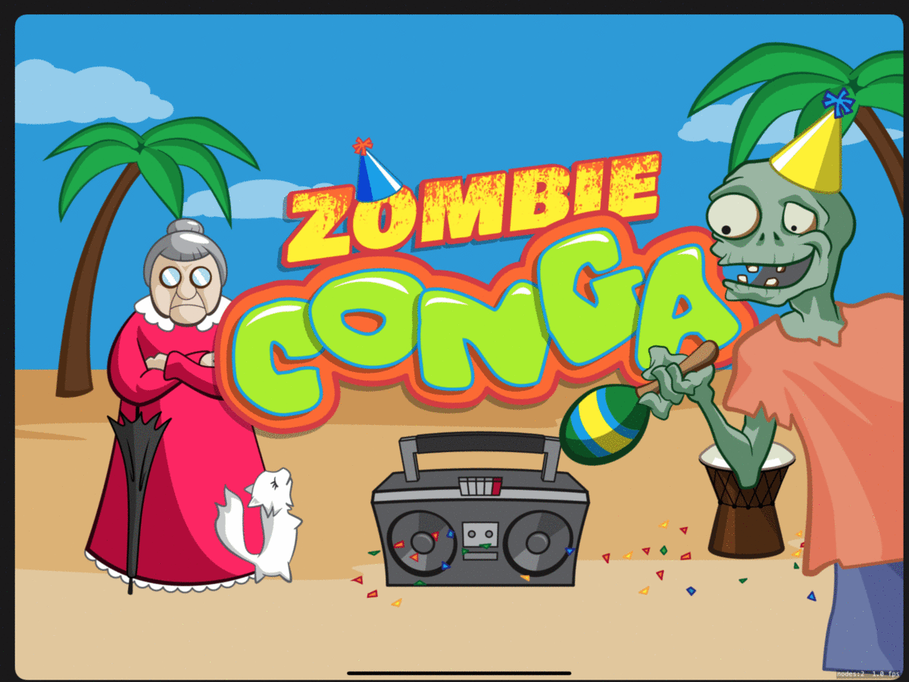
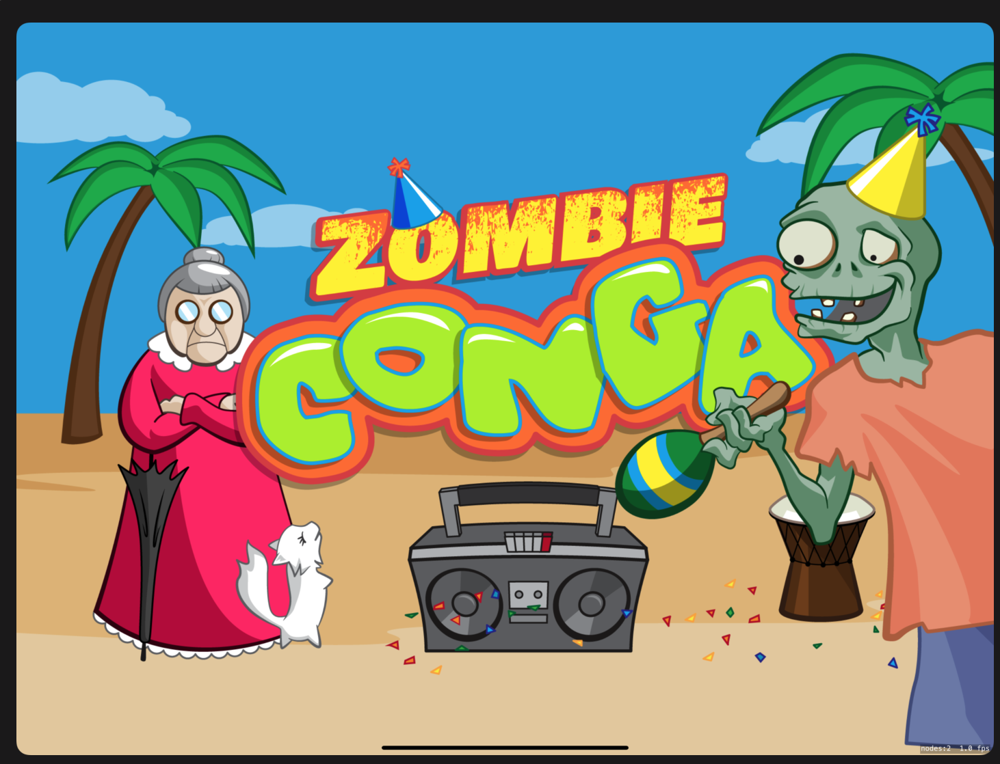
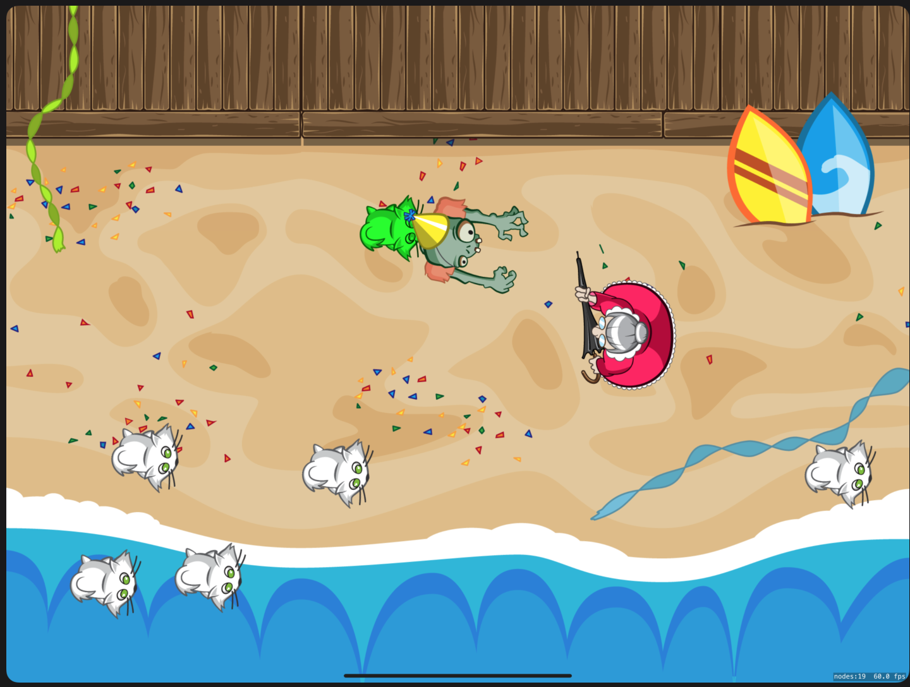
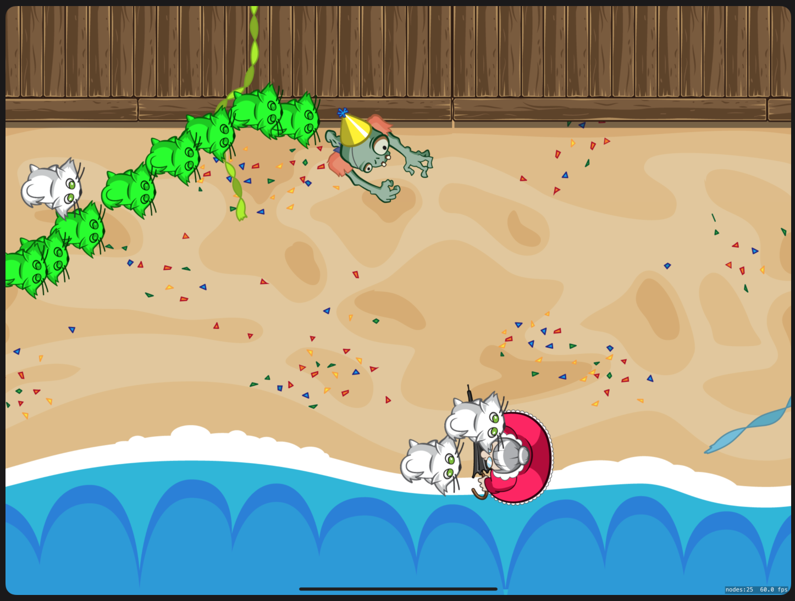
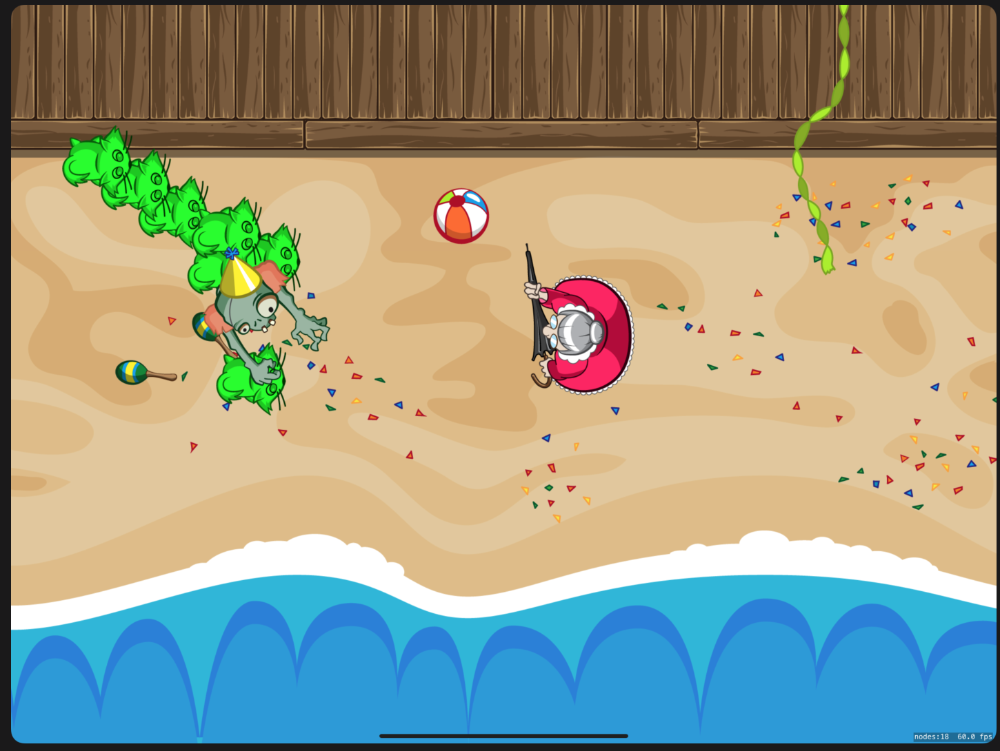
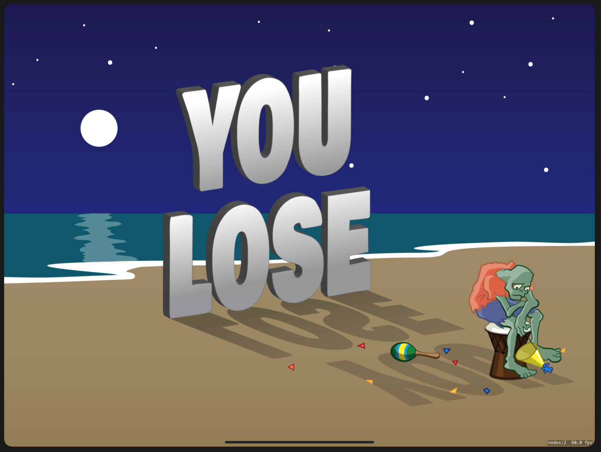

# IOSZombieGame
Zombie Conga Game is a game developed using SpriteKit Framework by using IOS in XCODE . This game is developed for purpose of learning SpriteKit and Game Development in IOS

# Steps to Make the game
This Project Wiki Link https://github.com/Tarlochan5268/IOSZombieGame/wiki

# Features
- Made in XCode
- UI Designed in Adobe Illustrator
- Made using Sprite Kit
- To Win collect 15 cats
- You Lose if hit by lady many times

# Screenshots:
 
 
 
 
 
 
